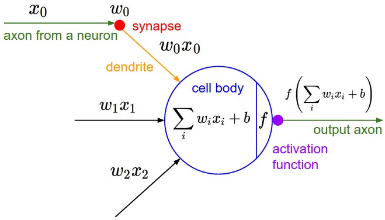
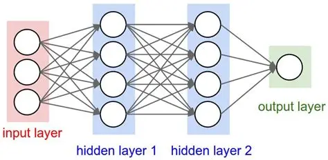

# micrograd-extended

A PyTorch-style extension of Andrej Karpathy's [micrograd](https://github.com/karpathy/micrograd): adds an `Activation` enum, per-layer activation control, and a cleaner MLP API built from composable `Layer` objects.

## What is micrograd?

micrograd is a minimalist scalar-valued autograd engine. 

Every operation on a `Value` object builds a computation graph, and calling `.backward()` propagates gradients through it via reverse-mode automatic differentiation. It's the same mechanism that powers PyTorch and JAX under the hood.

### The Neuron



Each neuron computes a weighted sum of its inputs plus a bias, then applies an activation function: 

All weights `w` and the bias `b` are `Value` objects, they are the trainable parameters.

### The Network



A full Multilayer Perceptron (MLP) stacks multiple layers of neurons. Each layer transforms its input and passes the result to the next, until the output layer produces a prediction.

---

## Extensions over the original

| Feature | Original micrograd | micrograd-extended |
|---|---|---|
| Activations | `nonlin=True/False` (ReLU only) | `Activation` enum: `ReLU`, `Tanh`, `Linear` |
| Activation control | Per-MLP | Per-layer |
| MLP API | `MLP(nin, [nouts])` | `MLP([Layer(...), Layer(...)])` |

---

## Usage

```python
from micrograd.nn import MLP, Layer, Activation

model = MLP([
    Layer(2, 4, Activation.ReLu),
    Layer(4, 4, Activation.ReLu),
    Layer(4, 1, Activation.Linear),
])

x = [0.0, 1.0]
y_pred = model(x)
print(y_pred)  # Value(data=...)
```

### Training loop

```python
learning_rate = 0.05

for epoch in range(200):
    y_pred = [model(x) for x in X]
    loss = sum((yp - yt) ** 2 for yp, yt in zip(y_pred, y))

    model.zero_grad()
    loss.backward()

    for p in model.parameters():
        p.data -= learning_rate * p.grad
```

---

## Installation

```bash
git clone https://github.com/finnrmnn/micrograd-extended
cd micrograd-extended
pip install -e .
```

### Graphviz (optional)
If you want to use the visualization of the calculation like Andrej in [Youtube: building micrograd](https://youtu.be/VMj-3S1tku0?si=mqSNXS63iRLqm6hV) do the following setup: 


```bash
# Install Graphviz
winget install graphviz   # windows
brew install graphviz     # macOS
sudo apt install graphviz # linux

# Install Python dependencies
pip install graphviz matplotlib 
```
> ensure Graphviz is added to the *path* variable (e.g., path add `C:\Program Files\Graphviz\bin`) 

---

## Credits

Built on top of [micrograd](https://github.com/karpathy/micrograd) by [Andrej Karpathy](https://karpathy.ai). The core autograd engine (`engine.py`) is his original work.